# UHC Transparency in Coverage — Presentación Técnica

> **Prueba técnica: Data Engineer**
> Pipeline de extracción, transformación y análisis de datos de transparencia sanitaria de UHC

---

## Resumen del Pipeline

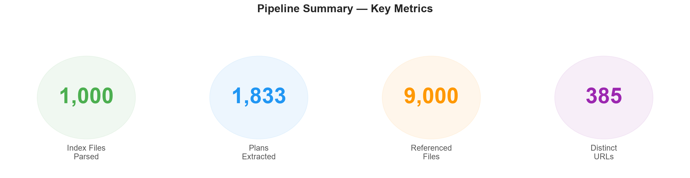

---

## 1. Contexto: ¿Qué es UHC Transparency in Coverage?

El gobierno de EE.UU. (CMS) obliga a las aseguradoras de salud a publicar sus **tarifas negociadas** con proveedores médicos en formato legible por máquinas (Machine-Readable Files).

**UnitedHealthcare (UHC)** publica estos archivos en:
`https://transparency-in-coverage.uhc.com/`

### Estructura de datos (esquema CMS v2.0):

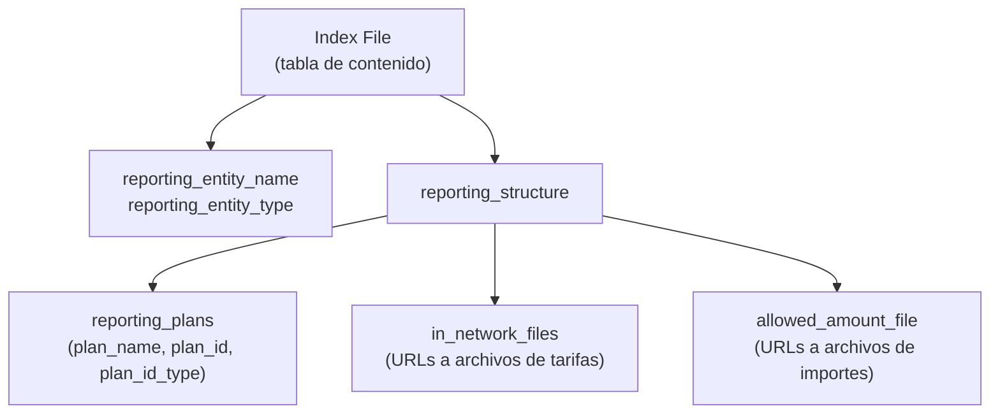

Cada empresa/empleador tiene un **index file** que apunta a archivos de tarifas que pueden pesar **varios gigabytes**.

---

## 2. El Reto Técnico

> [!WARNING]
> El sitio web de UHC NO es una página estática. Es una **Single Page Application (SPA)** construida con JavaScript.

**Problemas encontrados:**
- No se puede hacer scraping HTML con BeautifulSoup — la página renderiza contenido con JS
- No existe API pública documentada
- El servidor aplica **rate limiting** y devuelve errores 500 intermitentes
- Los archivos referenciados son enormes (multi-GB)

**Solución:** Descubrí que el sitio usa internamente una API REST:

```
GET https://transparency-in-coverage.uhc.com/api/v1/uhc/blobs/
```

Esta API devuelve un JSON con **86,514 blobs** (archivos disponibles), incluyendo nombre, URL de descarga y tamaño. De estos, filtré los `*_index.json` y tomé los primeros **1,000**.

---

## 3. Arquitectura del Pipeline

```mermaid
graph TB
    subgraph "Paso 1: Discovery"
        A["API UHC /blobs/"] -->|"GET JSON"| B["86,514 blobs"]
        B -->|"Filtrar *_index.json"| C["1,000 index files"]
        C --> D["index_manifest.csv"]
    end

    subgraph "Paso 2: Download"
        D --> E["Streaming download<br/>+ 3 reintentos<br/>+ backoff exponencial"]
        E --> F["1,000 archivos JSON<br/>en data/raw/"]
        E --> G["download_log.csv"]
    end

    subgraph "Paso 3: Parse"
        F --> H["Normalización JSON<br/>→ 4 tablas Parquet"]
        H --> I["index_files.parquet"]
        H --> J["plans.parquet"]
        H --> K["referenced_files.parquet"]
        H --> L["reporting_entities.parquet"]
    end

    subgraph "Paso 4: Insights"
        I --> M["Análisis + Visualización"]
        J --> M
        K --> M
        M --> N["insights_summary.md<br/>+ 11 gráficos PNG"]
    end

    style A fill:#E3F2FD,stroke:#1565C0
    style D fill:#E8F5E9,stroke:#2E7D32
    style F fill:#FFF3E0,stroke:#E65100
    style N fill:#F3E5F5,stroke:#6A1B9A
```

---

## 4. Paso a Paso: Explicación Detallada

### Paso 1 — Discovery ([01_discover_index_files.py](file:///c:/Users/jlbahon.INDRA/Documents/GitHub/UNH-DE-CODE-TEST/src/01_discover_index_files.py))

**¿Qué hace?** Consulta la API de UHC para obtener la lista completa de archivos disponibles y filtra los index files.

**¿Por qué así?**
- El sitio es una SPA → no funciona scraping HTML
- La API devuelve JSON estructurado → mucho más fiable
- Filtramos por `*_index.json` porque la tarea pide específicamente los archivos índice
- Limitamos a 1,000 como indica la tarea

**Código clave:**
```python
# Llamada directa a la API interna de UHC
response = requests.get("https://transparency-in-coverage.uhc.com/api/v1/uhc/blobs/",
                        timeout=120, headers={"Accept": "application/json"})
blobs = response.json().get("blobs", [])  # → 86,514 blobs

# Filtrar solo index files
for blob in blobs:
    if blob["name"].endswith("_index.json"):
        # Guardar: file_name, download_url, file_size_bytes
```

**Resultado:** `data/processed/index_manifest.csv` con 1,000 filas.

---

### Paso 2 — Download ([02_download_index_files.py](file:///c:/Users/jlbahon.INDRA/Documents/GitHub/UNH-DE-CODE-TEST/src/02_download_index_files.py))

**¿Qué hace?** Descarga los 1,000 archivos JSON del manifest de forma segura.

**¿Por qué así?**
- **Streaming download** → evita cargar archivos grandes en memoria
- **3 reintentos con backoff exponencial** (2s, 4s, 8s) → maneja errores 500 del servidor
- **Size guard** → omite archivos mayores a 512 MB para proteger disco local
- **Rate limiting** → delay configurable entre descargas para respetar límites del servidor
- **Idempotente** → si un archivo ya existe, lo salta (permite re-ejecutar sin duplicar trabajo)
- **Barra de progreso** (tqdm) → visibilidad en tiempo real

**Código clave:**
```python
# Retry con backoff exponencial
for attempt in range(1, retries + 1):
    try:
        with requests.get(url, stream=True, timeout=timeout) as r:
            r.raise_for_status()
            for chunk in r.iter_content(chunk_size=256*1024):
                f.write(chunk)
    except Exception:
        wait = BACKOFF_BASE ** attempt  # 2s, 4s, 8s
        time.sleep(wait)
```

**Resultado:** 1,000/1,000 archivos descargados (0 fallos). ~2.7 MB total.

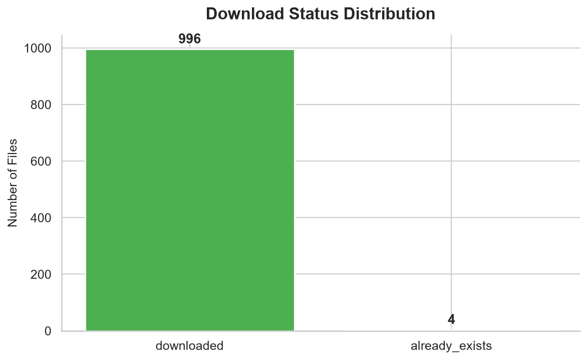

---

### Paso 3 — Parse ([03_parse_index_files.py](file:///c:/Users/jlbahon.INDRA/Documents/GitHub/UNH-DE-CODE-TEST/src/03_parse_index_files.py))

**¿Qué hace?** Normaliza los JSON anidados en 4 tablas planas almacenadas en Parquet.

**¿Por qué así?**
- Los JSON tienen **estructura anidada** (reporting_structure → plans → files) → necesitamos aplanar
- **Parquet** es columnar → consultas analíticas rápidas, compatible con Snowflake/Spark/Pandas
- **Modelo normalizado** → evita redundancia, permite JOINs limpios
- **Parse separado de download** → un fallo en descarga no bloquea análisis del resto

**Modelo de datos:**

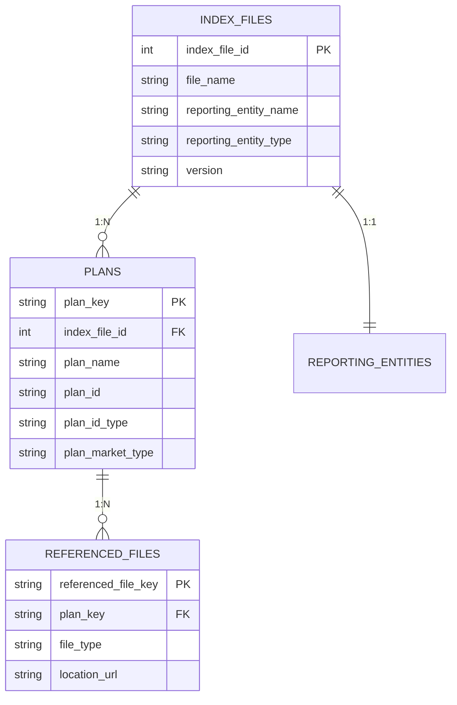

**Resultado:** 1,000 index files → 1,833 planes → 9,000 archivos referenciados. **100% parse rate.**

---

### Paso 4 — Insights ([04_generate_insights.py](file:///c:/Users/jlbahon.INDRA/Documents/GitHub/UNH-DE-CODE-TEST/src/04_generate_insights.py) + [05_advanced_insights.py](file:///c:/Users/jlbahon.INDRA/Documents/GitHub/UNH-DE-CODE-TEST/src/05_advanced_insights.py))

**¿Qué hace?** Genera un reporte Markdown con métricas clave y 11 gráficos PNG con análisis visual profundo.

**¿Por qué dos scripts?**
- `04` genera el reporte textual con tablas → rápido, ligero
- `05` genera visualizaciones con matplotlib/seaborn → profundidad analítica para la entrevista

---

## 5. Insights del Datos

### Insight A: Centralización Masiva de Datos

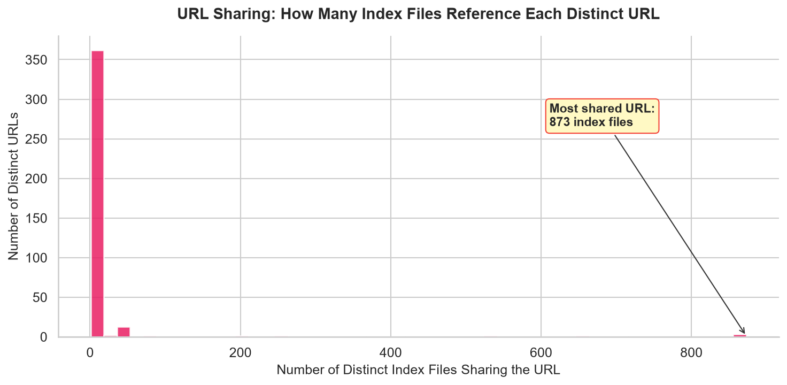

**Hallazgo:** Solo **385 URLs distintas** sirven **9,000 referencias**. Un solo archivo de tarifas es referenciado por hasta **873 archivos índice**.

**¿Qué significa?** UHC usa un **modelo hub-and-spoke**: un pequeño conjunto de archivos de tarifas negociadas es compartido por cientos de empleadores. La personalización de tarifas a nivel de empleador es rara — la mayoría de empresas obtienen las mismas tarifas negociadas.

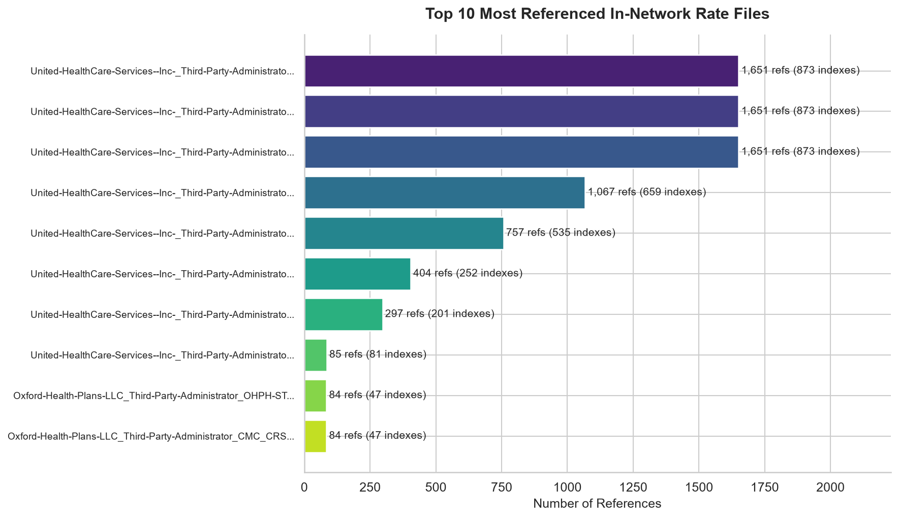

---

### Insight B: Concentración de Entidades

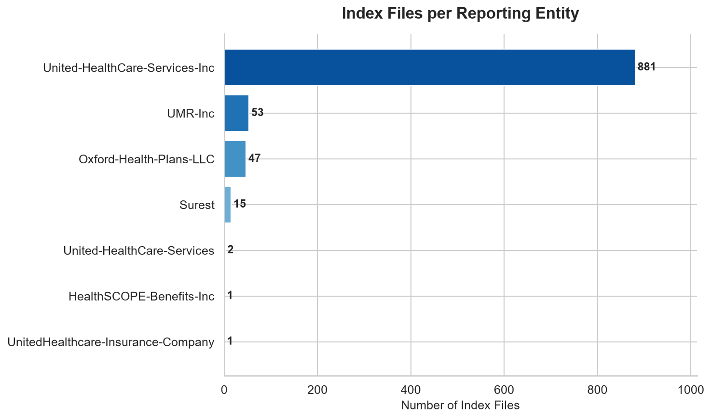

**Hallazgo:** **88.1%** de los archivos pertenecen a **United-HealthCare-Services-Inc**. Todas las entidades son **Third-Party Administrators (TPAs)**.

**¿Qué significa?** UHC opera principalmente como administrador tercero (TPA). Oxford Health Plans (4.7%) y UMR (5.3%) son administradores secundarios, probablemente para segmentos regionales o especializados.

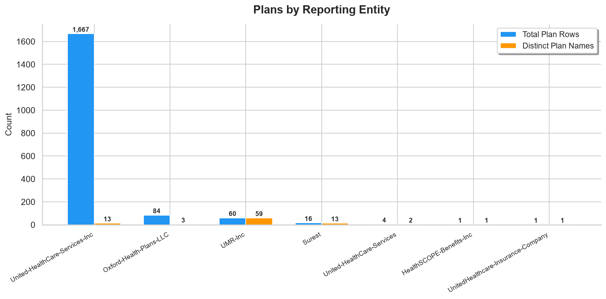

---

### Insight C: Portfolio de Redes de Seguros

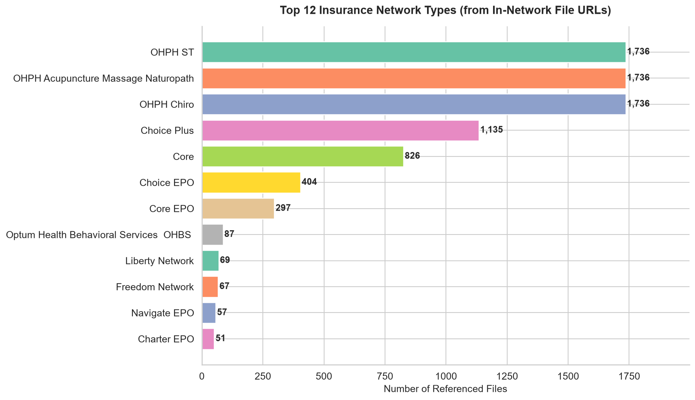

**Hallazgo:** Las redes más populares son:
1. **OHPH ST** — 1,736 referencias (red de Optum Health para servicios estándar)
2. **OHPH Acupuncture/Massage/Naturopath** — 1,736 refs (medicina alternativa)
3. **OHPH Chiro** — 1,736 refs (quiropráctica)
4. **Choice Plus** — 1,135 refs (red PPO principal de UHC)
5. **Core** — 826 refs (red básica)

**¿Qué significa?** Las redes OHPH (Optum Health) aparecen en casi todos los planes, lo que sugiere que los servicios de salud complementarios son **obligatorios** en la mayoría de planes UHC. Choice Plus es la red PPO más común.

---

### Insight D: Complejidad de Planes por Empleador

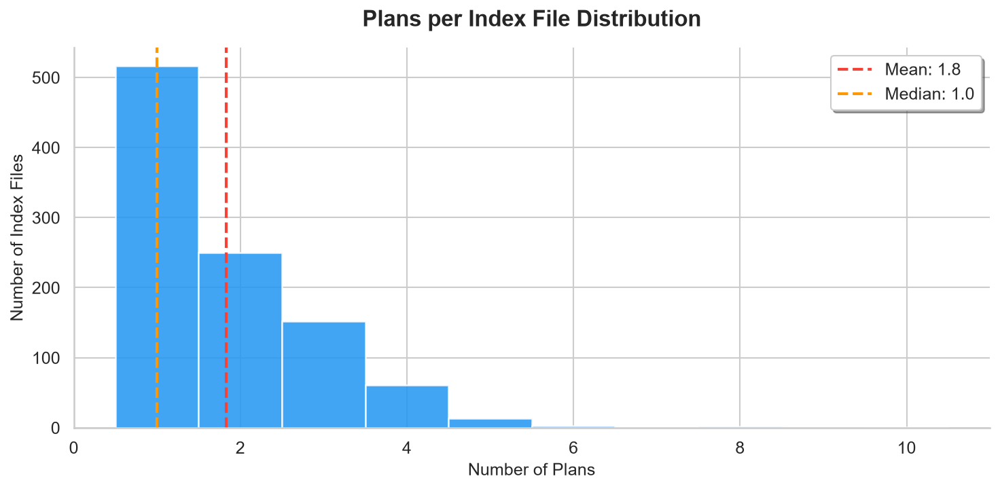

**Hallazgo:**
- **51.7%** de empleadores tienen exactamente **1 plan** (plan único)
- **48.3%** tienen **múltiples planes** (hasta 10)
- Media: 1.83 planes por empleador

**¿Qué significa?** La mayoría de empresas pequeñas ofrecen un solo plan de salud. Las empresas más grandes ofrecen múltiples opciones, lo que aumenta la complejidad del reporting de transparencia.

---

### Insight E: Tipos de Archivos Referenciados

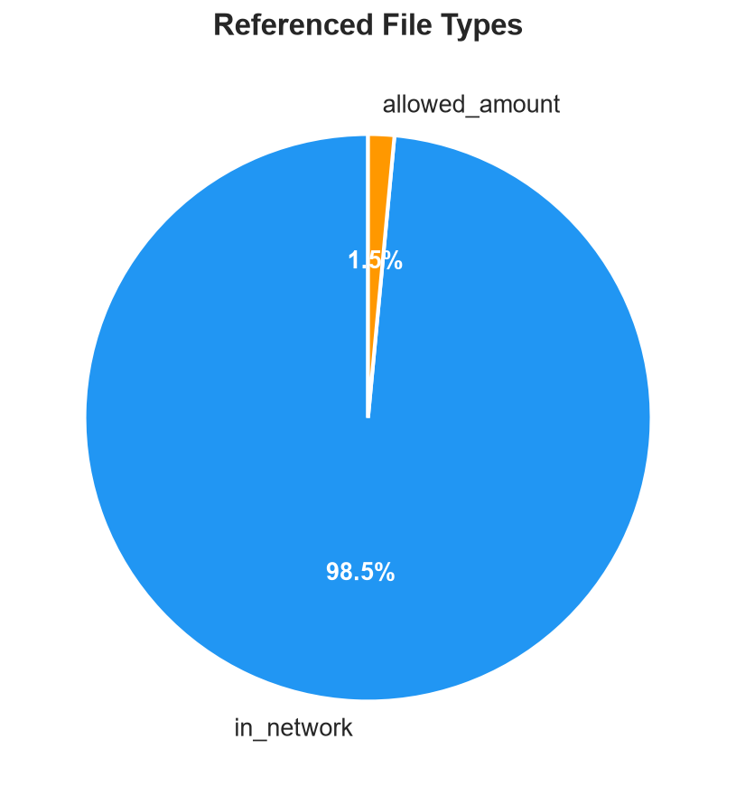

**Hallazgo:** El **98.5%** de archivos referenciados son **in-network rates** vs solo **1.5%** de allowed amounts.

**¿Qué significa?** Casi toda la data de transparencia se centra en las tarifas negociadas con proveedores dentro de la red. Los archivos de "allowed amounts" (para servicios fuera de red) son mucho menos comunes, lo que sugiere que UHC prioriza la cobertura dentro de red.

---

### Insight Adicional: Distribución de Tamaños y Referencias por Índice

````carousel
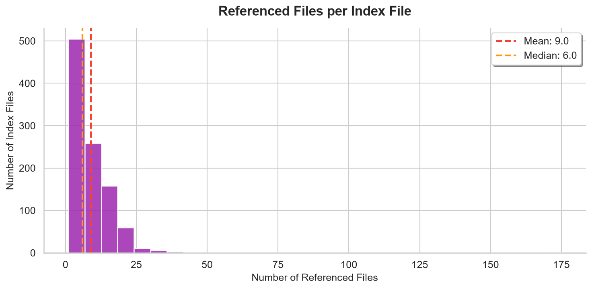
<!-- slide -->
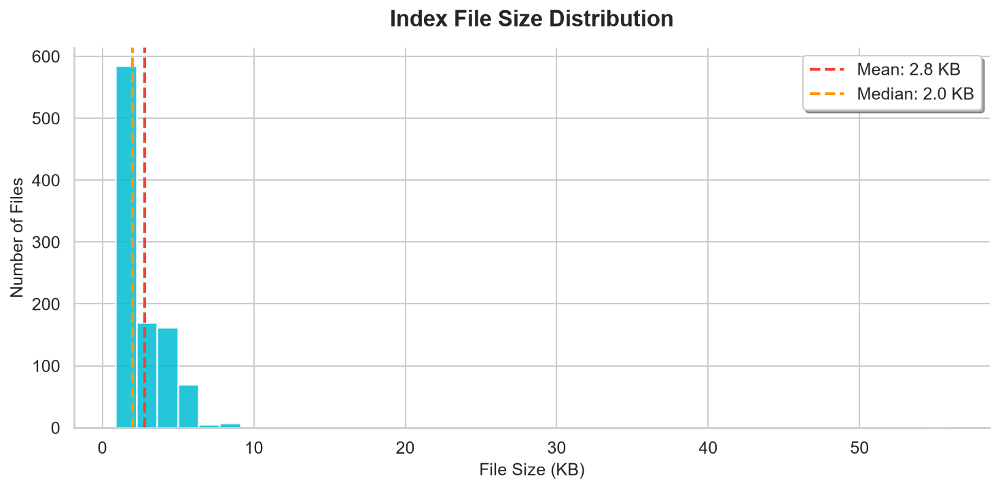
````

- **Media de 9 archivos referenciados** por index file
- Los index files son ligeros (2-3 KB media), pero referencian archivos de **gigabytes**
- Volumen total descargado: solo **2.7 MB** para 1,000 índices

---

## 6. Calidad de Datos

| Check | Resultado |
|-------|-----------|
| Archivos descargados correctamente | ✅ 1,000/1,000 (100%) |
| Archivos parseados sin error | ✅ 1,000/1,000 (100%) |
| `reporting_entity_name` no nulo | ✅ 0 nulos |
| `plan_name` no nulo | ✅ 0 nulos |
| `plan_id` no nulo | ✅ 0 nulos |
| `location_url` no nulo | ✅ 0 nulos |
| Versión del esquema | Todas las versiones presentes |

> [!TIP]
> No se detectaron problemas de calidad en los 1,000 archivos analizados. Esto indica que UHC mantiene un buen control de calidad en sus publicaciones de transparencia.

---

## 7. Decisiones de Diseño

| Decisión | Alternativa | Por qué elegí esta opción |
|----------|-------------|---------------------------|
| API REST vs Scraping HTML | Selenium/Playwright | Más rápido, más fiable, sin dependencia de navegador |
| Streaming download | `json.load()` completo | Evita cargar archivos grandes en memoria |
| Retry + backoff exponencial | Retry simple | Respeta rate limits del servidor, evita ban |
| Parquet | CSV | Columnar, tipado, compresión, compatible con Snowflake |
| Modelo normalizado | JSON plano | Evita redundancia, permite JOINs eficientes |
| Pipeline en 4 pasos | Script monolítico | Cada paso es independiente, recuperable, testeable |
| Download idempotente | Re-descargar siempre | Ahorra tiempo en re-ejecuciones |

---

## 8. Productivización

```mermaid
graph LR
    subgraph "Orquestación"
        A["Apache Airflow<br/>o Azure Data Factory"]
    end

    subgraph "Pipeline Diario"
        B["Discover"] --> C["Download"] --> D["Parse"] --> E["Load Snowflake"]
    end

    subgraph "Monitorización"
        F["Alertas en fallos"]
        G["Data quality checks"]
        H["Anomalías de volumen"]
    end

    A --> B
    E --> F
    E --> G
    E --> H

    style A fill:#E3F2FD
    style E fill:#E8F5E9
    style F fill:#FFEBEE
```

**Mejoras para producción:**
- **Orquestación:** Airflow/ADF con scheduling mensual (UHC actualiza datos cada mes)
- **Incremental:** Rastrear `last_updated_on` para solo descargar archivos nuevos
- **Storage:** Raw en S3/ADLS, curado en Snowflake con dbt
- **CI/CD:** GitHub Actions para tests y deploy
- **Monitoring:** Alertas en fallos de descarga, anomalías de parse rate, cambios de volumen
- **Seguridad:** Credenciales en secrets manager, cifrado at-rest

---

## 9. Stack Tecnológico

| Componente | Tecnología |
|------------|-----------|
| Lenguaje | Python 3.14 |
| HTTP | requests (streaming) |
| Procesamiento | pandas |
| Almacenamiento | Parquet (pyarrow) |
| Visualización | matplotlib + seaborn |
| Base de datos (opcional) | Snowflake |
| Progreso | tqdm |
| Control de versiones | Git + GitHub |

---

## 10. Cómo Ejecutar

```bash
# Setup
python -m venv .venv
.venv\Scripts\activate
pip install -r requirements.txt

# Pipeline completo
python src/01_discover_index_files.py --limit 1000    # ~15 seg
python src/02_download_index_files.py --limit 1000    # ~35 min
python src/03_parse_index_files.py                     # ~1 min
python src/04_generate_insights.py                     # ~30 seg
python src/05_advanced_insights.py                     # ~10 seg

# Opcional: cargar a Snowflake
python src/06_load_to_snowflake.py
```

---

## 11. Estructura del Repositorio

```
UNH-DE-CODE-TEST/
├── src/
│   ├── 01_discover_index_files.py   ↠ API discovery
│   ├── 02_download_index_files.py   ↠ Streaming download + retry
│   ├── 03_parse_index_files.py      ↠ JSON → 4 tablas Parquet
│   ├── 04_generate_insights.py      ↠ Reporte textual
│   ├── 05_advanced_insights.py      ↠ Gráficos + insights profundos
│   ├── 06_load_to_snowflake.py      ↠ Carga opcional a Snowflake
│   └── utils/
│       ├── __init__.py
│       └── io_utils.py
├── sql/
│   ├── create_tables.sql            ↠ DDL Snowflake
│   └── insights.sql                 ↠ Queries analíticas
├── data/
│   ├── raw/                         ← 1,000 JSON descargados
│   └── processed/                   ← Parquet + CSV de log
├── reports/
│   ├── insights_summary.md          ← Reporte principal
│   ├── extended_insights.md         ← Análisis profundo
│   └── charts/                      ← 11 gráficos PNG
├── requirements.txt
├── config.example.env
└── README.md
```

